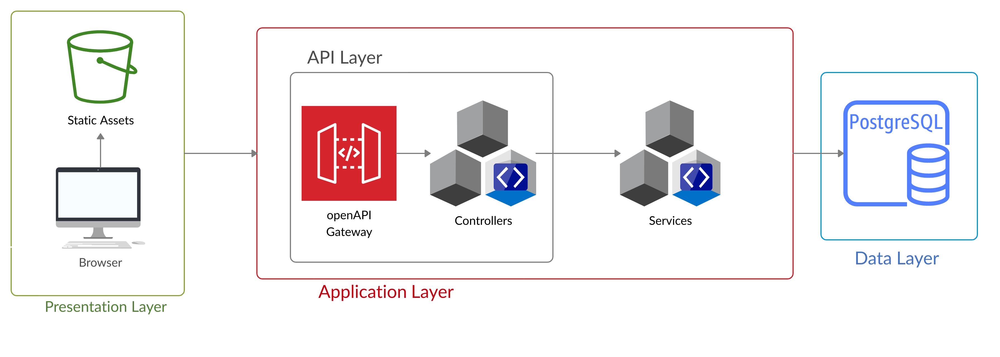

## General group information
| Member n. | Role          | First name | Last Name | Student ID | Email address                        |
|-----------|---------------|------------|-----------|------------|--------------------------------------|
| 1         | administrator | Samuele    | Milanesi  | 10522465   | samuele.milanesi@mail.polimi.it      |
| 2         | member        | Alessandro | Lazzaretti| 10499172   | alessandro.lazzaretti@mail.polimi.it |
| 2         | member        | Andrea     | Pasotti   | 10493242   | andrea.pasotti@mail.polimi.it        |

## Links to other deliverables
- Deliverable D0: the web application is accessible at [this
address](https://milanogreen.herokuapp.com/).
- Deliverable D2: the YAML or JSON file containing the specification
of the app API can be found at [this
address](https://milanogreen.herokuapp.com/backend/spec.yaml).
- Deliverable D3: the SwaggerUI page of the same API is available at
[this address](https://milanogreen.herokuapp.com/backend/swaggerui).
- Deliverable D4: the source code of D0 is available as a zip file at
[this address](https://milanogreen.herokuapp.com/backend/app.zip).
- Deliverable D5: the address of the online source control repository
is available [this address](https://bitbucket.org/cloudyowls/milanogreen/). We hereby
declare that this is a private repository and, upon request, we will
give access to the instructors.
## Specification
### Web Architecture


Our application is composed of three main layers: 
    - Presentation layer: layer in which the application is visualized and the user can interact with. Built using The presentation layer has been built by using HTML5, Javascript, CSS3 in particular using Bootstrap and jQuery libraries.
    - Application layer: layer in which the logic of the application is managed. Built using NodeJS and is accessed interacted via OpenApi.
    - Data layer: here we store and organize the data via a PostgreSQL database.
### API
#### REST compliance

The logic of our application is thought to be simple, complete and safe:
- the application is essentially stateless: the server doesn't store any user data or information and doesn't manage cookies because it is not necessary. There's no login, so we did not manage sessions.
- according to REST principles, many URI addressed resources are accessible: we used mainly the nilpotent method GET to access the resources.
- the architecture is totally client-server and each part can be developed indipendently from the other: this ensures the scalability of the application.

#### OpenAPI Resource models
The API specifies every resource as JSON object: the data types are here reported.

```
- EVENT
    - eventID int 
    - name string
    - date string
    - address string
    - type string
    - image string
    - contact_id integer
    - icon string
    - description string
    - timestamp integer

- PEOPLE
    - personID int 
    - name string
    - role string
    - motto string
    - image string
    - mail string
    - phone string
 
- SERVICE
    - id integer
    - name string
    - image string
    - description string
```

### Data model
We use the following schema: starting from the base of our association, the human recources, every person is linked with several events and services (all the related services and events are more close as possible in terms of topics), the same for the services (with respect to people and events); on the other hand there exist a unique person related to each event (while services and events are still in an n:n relation), so the relation person =-> event is the only one that is not n:n (but only 1:n).

To be consistent with the definition we assigned to each person, service and event a unique ID, this architecture helps also to define the n:n relations, task due thanks to the design of an intermediate table containing the two IDs of the relation plus a fundamental univoque ID of itself.


## Implementation
### Tools used
- The backend of the application is created with NodeJS
- The skeleton has been generated using the Swagger editor
- To connect the Postgres database we used the knex module
- To test the accessibility of the application we used the Google Chrome plugin Wave.

### Discussion

- How did you make sure your web application adheres to the provided
OpenAPI specification? Which method did you use to test all APIs
endpoints against the expected response?

We red the documentation of Swagger OpenApi to be sure to write a correct API with a probability of almost 1 (and we hope we managed to reach that level of precision). All our endpoints have been tested in first place through the usage of the Swagger UI. After that, during the filling of the dynamic pages, we tested the final version with lot of attempts.

- Why do you think your web application adheres to common practices to
partition a REST-based web application (static assets vs.
application data)

We tried to work in accordance with REST-based specification: we separated static contents from "dynamic" contents, dynamics meaning the data that fill the dynamic pages. So we have different separate layers: data are fetched with a call from the client, then it is executed in the client browser that makes a request to the server to fill the page with the received data.
The only static assets we do not fetch from the database are the pages that are not thought to be expanded or modified and have no relationship with other pages.

- Describe synthetically why and how did you manage session state,
what are the state change triggering actions (e.g., POST to login
etc..).
As explained previously our application is stateless.

- Which technology did you use (relational or a no-SQL database) for
managing the data model?

None of us knew about database technology (nobody of us has attended a database course), so we decide to use Postgres, an object-relational database, as suggested during the lectures. 
Every query is managed by KNEX node module.

## Other information    
### Task assignment
Describe here how development tasks have been subdivided among members
of the group, e.g.:
| Name                  | Design        | Frontend   | Backend   |
|-----------------------|---------------|------------|-----------|
| Samuele Milanesi      | 30%           | 40%        | 50%       |
| Alessando Lazzaretti  | 20%           | 40%        | 30%       | 
| Andrea Pasotti        | 50%           | 10%        | 30%       |

### Analysis of existing API

We red the openAPI specification (https://swagger.io/specification/) and, after having understand the most improtant concepts from that, we tried to replicate what the professor Zaccaria did during the backend lectures applying his stream of knowledge to fit the needs of our simple, but complete, architecture.

### Learning outcome
- Alessandro learned a lot about the frontend and the SQL queries and his next goal will be to apply what he learned to manage the website of the association he works with (i.e. Emergency squad for Milan), he will need to study more about databases but he feels ready for that task.

- Samuele learned javascript and how to deploy on the cloud (and in particular on Heroku), he's interested in learning more about javascript promises and databases. His next goal will be to apply everything that he learned to improve his startup QRabby.

- Andrea learned how to write an API in order to manage the logic of a web application in a proper way. He would like to learn more about front end technology, in particular the design, because is something that he has never done before this course and he discovered that he likes it.


This project has been very interesting, it has allowed us to understand properly what there is behind a website, something that is very familiar at a simple level but that masks a lot of difficult and tricky stuff we loved to interact with.